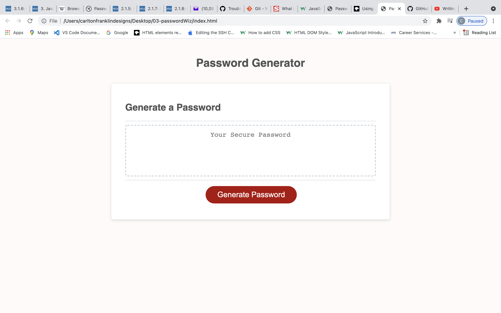
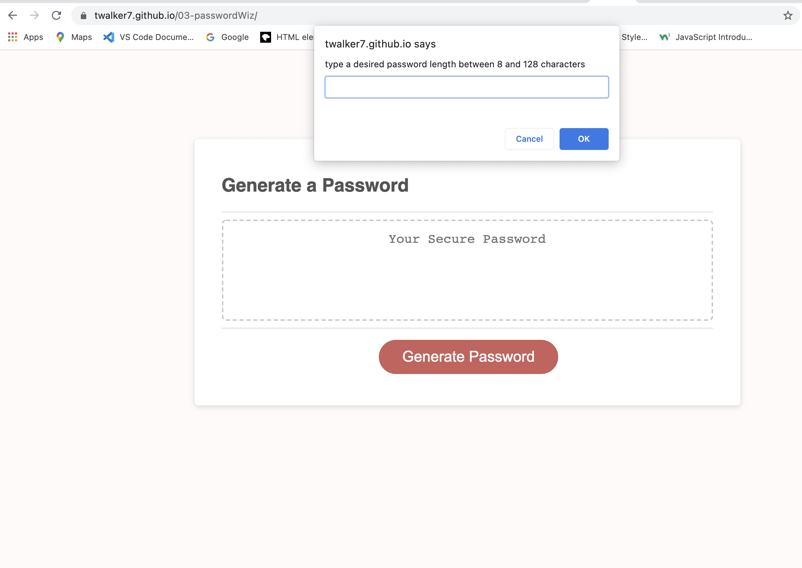
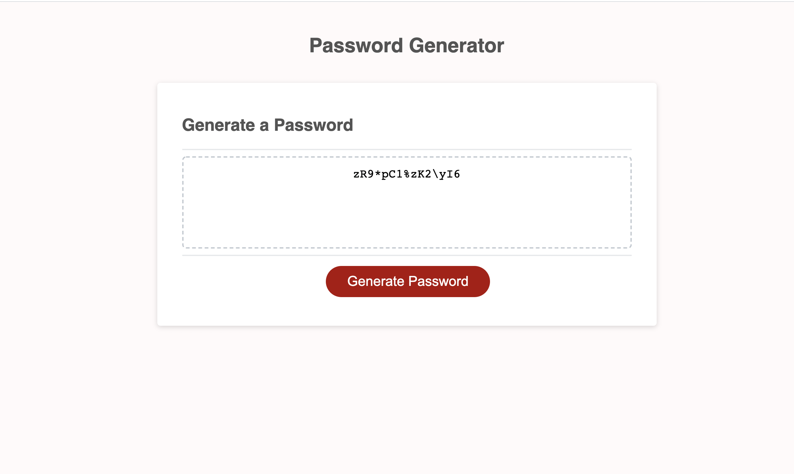

# The Password Wizard Password Generator 

## Description
This password generator takes input from prompt and confirmation boxes, returning a string following the specifications chosen in the prompts.

    

## Purpose 
A simple password gnerator designed to return a string based upon the specifications of character types allowed, creating ease for users who want a random password created. This application was meant to fulfil course requirements at UCLA Extension's coding bootcamp

## Built With 
HTML, CSS, JS

## Snapshot of Application 

## Website 

https://twalker7.github.io/03-passwordWiz/

## Contribution 
the program was largely already built as part of the curriculum at UCLA Extension Coding Bootcamp; my contribution only being in the creation of a function within the already-built Javascript file. Javascript code modified by Thomas Walker